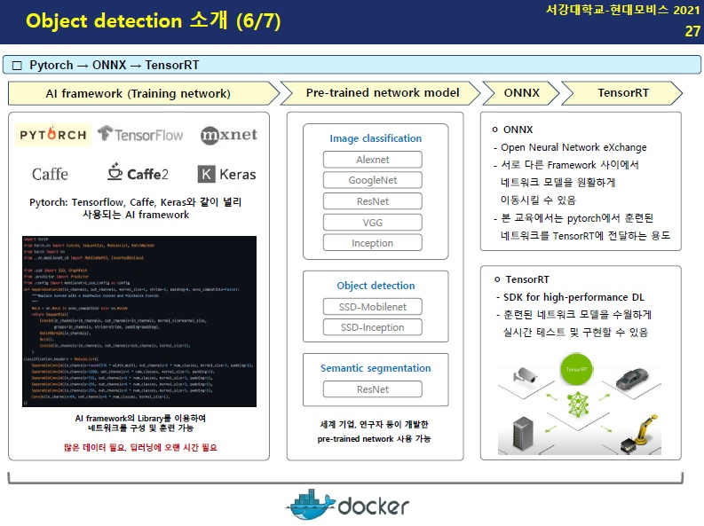
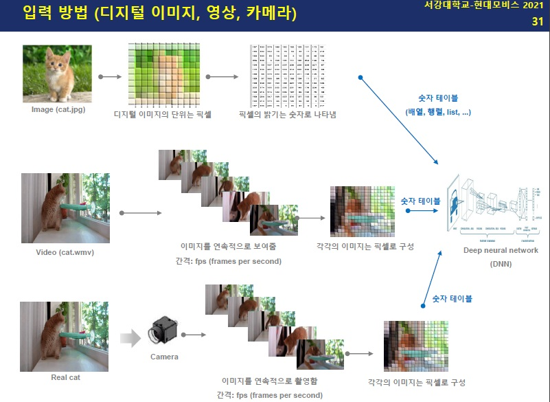
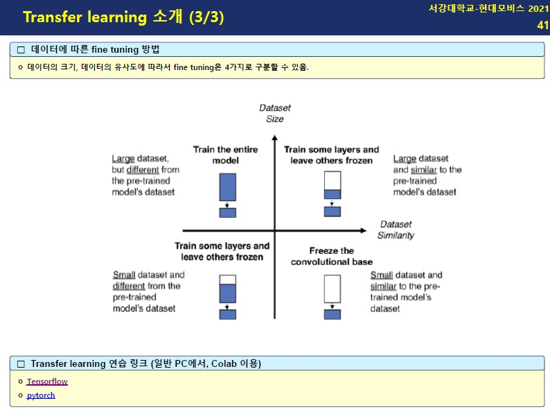

# Jetson Nano

- 엔비디아(Nvidia)에서 제작한 싱글보드 컴퓨터(Single Board Computer, SBC)
- 한 개의 보드에 운영체제(윈도우, 리눅스 등)를 설치하여 컴퓨터처럼 활용할 수 있고, 모터제어, 센서 신호 수집 가능

- 장점
  - 사이즈가 작으며, 리눅스 환경에 최적화 된 칩셋, 여러 대를 연결하여 병렬 구성이 가능
  - 저전력으로 GPU 사용 가능
- `Edge computing`
  - 반대의 개념은 `Cloud computing`
    - server와 무선으로 통신하여, AI를 활용하는 방법
  - 이동식 (Portable, Mobile) 시스템에서,  `Cloud computing`에 비해 높은 반응속도, 보안 이슈에 비교적 안정적이며, 비용이 저렴하다.

# Docker

- Docker의 Jetson container는 GPU 기반 AI 개발을 위한 프레임워크가 설치되어 있다.
- Jetson nano 구동을 위한 라이브러리, 구성 파일 등을 다양한 환경(server, PC)에서 사용할 수 있다.
- 기존의 Virtual 머신보다 크기가 작으며, OS없이 빠르게 실행할 수 있다.

# Object Detection

## Operation flow

## Deep learning in relation to Machine learning

- 네트워크 학습 외에, 정확도 향상을 위한 작업이 많이 간소화된다.
- 많은 데이터를 필요로 하고, 학습에 오랜 시간이 걸린다. (GPU, 병렬처리 알고리즘 개발 등으로 학습 기간 단축을 위한 노력)

## input data

- 입력되는 이미지 소스는 크게 3가지 형태가 있을 수 있다.
  - 단일 이미지
  - 동영상
  - 카메라
- 이미지를 처리하는 Loop의 반복 횟수에만 차이가 있을 뿐 기본적으로 이미지를 바라보고 DNN을 만든다는 기본적인 컨셉은 동일하다.

# Transfer Learning

- A라는 문제를 해결할 때, 얻은 지식을 (비슷한) B라는 문제에 적용하고자 하는 학습 방법

## Fine tuning

- 위대한 연구자, 기업들이 만들어 놓은 Deep learning network를 가져와서 나의 목적에 맞게 일부 파라미터를 조정하는 것.

  

