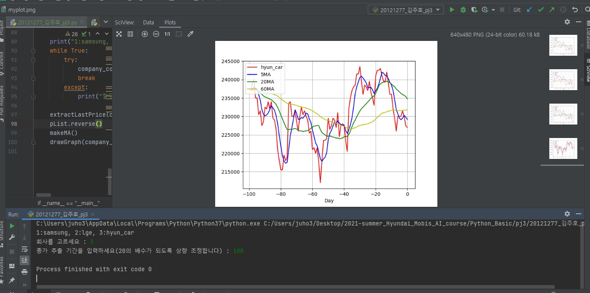

# Goal

1. Crawl stock data from "https://finance.naver.com/item/frgn.nhn?code=" + company_code + "&page="
2. Calculate Moving Mean using Queue data structure
3. Plot data with matplotlib python package

# Result

  