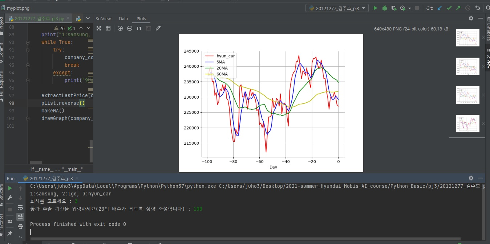
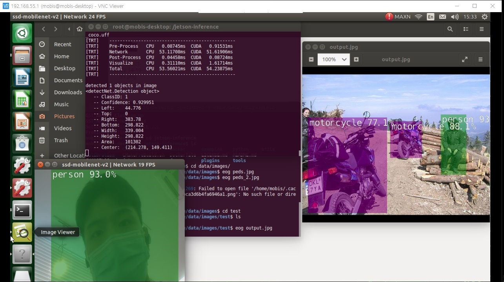
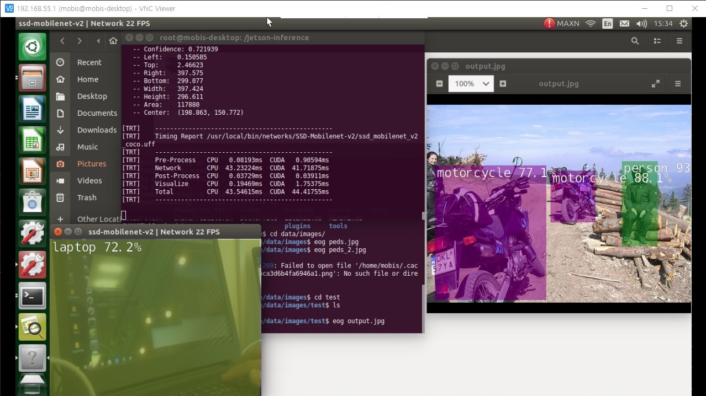
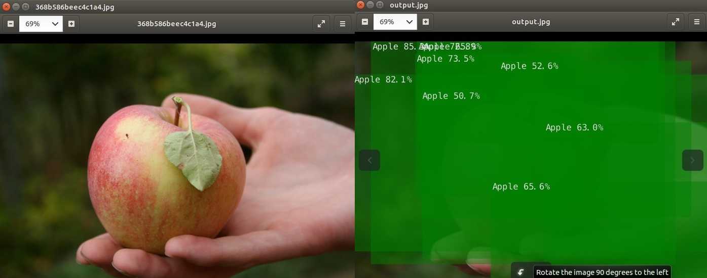
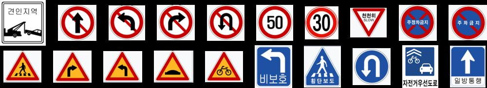
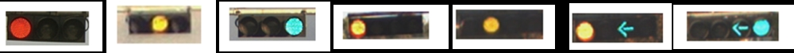

# Goal

- Get code skill for AI
- CCD카메라와 MCU를 활용하여 다음의 시스템 중 하나를 구현함.
  1. 20가지 교통표지판 인식 시스템
  2. 자동차 여부 인식 시스템
  3. 차량 신호등의 신호 인식 시스템
  4. 5자리 손글씨 숫자 인식 시스템

# Expected Result

- Get python coding skill
- CCD 카메라 기반 영상 인식 기술 및 지식 습득
- MCU를 활용하여 데이터 수집부터 데이터 전처리, 딥러닝 적용까지의 전 과정 개발 경험

# Program

| 일정                 | 교육 내용                                                    |
| -------------------- | ------------------------------------------------------------ |
| 1일차(월)            | - 프로그램 및 교수진 소개 - 파이썬 기초 (숙련자는 비대면 파이썬 과제 제출) |
| 2일차(화), 3일차(수) | - 파이썬 기초 (숙련자는 비대면 파이썬 과제 제출)             |
| 4일차                | - Jetson nano 및 CCD 카메라 등 재료 배포 - Jetson nano 활용 기초 튜토리얼 수행 |
| 5일차                | - Jetson nano 활용 딥러닝 기반 영상 인식 튜토리얼 수행       |
| 6일차                | - 특강(온라인 비대면)                                        |
| 7일차                | - 데이터 수집 - 학습을 위한 데이터 가공                 |
| 8일차                | - 정확도 향상을 위한 방법 적용 (데이터 전처리, 샘플링 기법 등) - 1차 보고서 제출 및 개별 면담 |
| 9일차                | - 인공지능 학습 - 테스트 결과 도출 - 2차 보고서 제출 및 결과 발표 |
| 10일차               | - 실제 도로 및 손글씨에서 인공지능 테스트 영상 촬영          |
| 11일차               | - 최종 결과 PPT 발표 - 우수 학생 수상                   |

## Day 1 ~ Day 3 : Python basic

### day 3 - Crawling and Plot 

### day 4 - Object Detection with Jetson Nano

- 마스크를 착용하였음에도 높은 확률로 person이라고 detection

- labtop 인식

### day 5 - transfer learning

Apple 만을 학습한 AI

# Evaluation

- 20가지 교통표지판 인식

   [서강대학교정문-신촌로터리-이대역-서강대후문-서강대길-서강대학교정문]에 위치한 아래의 20가지 교통표지판을 선정하였으며, 최종 시스템은 표지판의 종류를 맞춰야 함.

    

<그림. 20가지 도로교통표지판>

​    

- 차량신호등의 신호 인식

  [서강대학교정문-신촌로터리-이대역-서강대후문-서강대길-서강대학교정문] 루트에 설치된 신호등의 신호는 아래의 7가지로 구성되며, 최종 시스템은 신호 종류를 맞춰야 함.

    

<그림. 7가지 도로교통 신호 (3구 신호등 3가지 신호와 4구 신호등 4가지 신호)>

​    

-  자동차 인식

  [서강대학교정문-신촌로터리-이대역-서강대후문-서강대길-서강대학교정문] 루트에서, 최종 시스템은 카메라에 촬영되는 자동차를 자동차로 인식해야 함.

​    

- 5자리 손글씨 숫자 인식

  강사가 미리 작성해둔 5자리 손글씨 숫자 20세트를 카메라 앞에 두었을 때, 시스템은 숫자를 맞춰야함.

